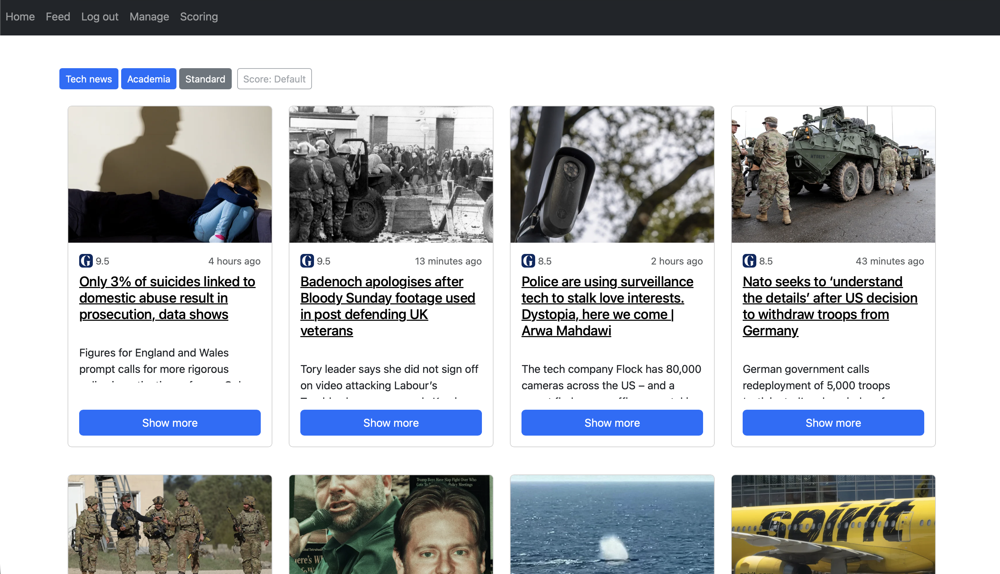
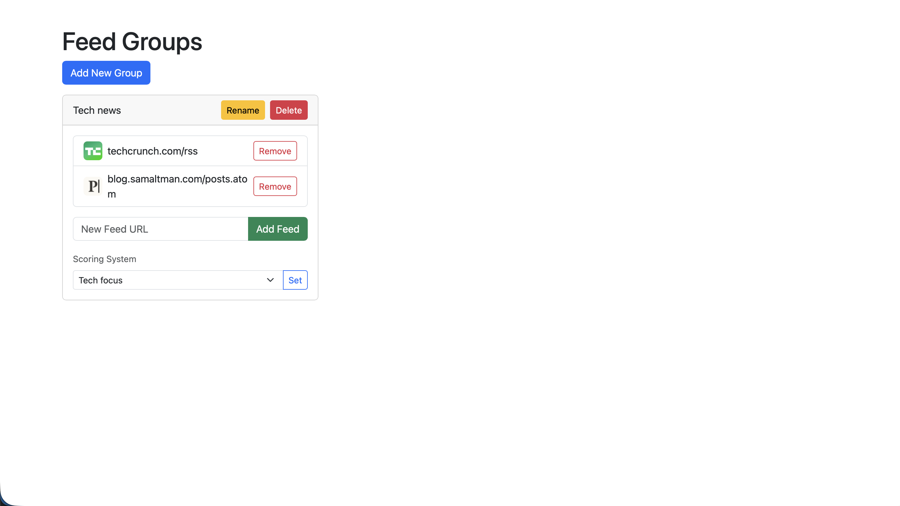
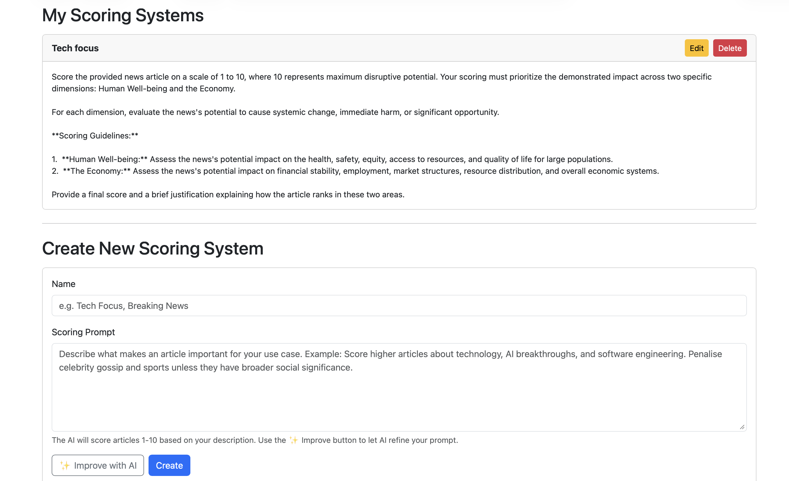

Warning: This project will eat tokens very quickly. Recommended to use cheap models or locally hosted ones. Gemma4 is recommended. 

# LLM-based filter for rss-reader
This project is essentially an original rss-reader application based on the feedparser library.
I have decided to make it more like a social media feed page rather than a standard rssreader, which means
- No "mark as read" and no "1423 unread articles" header or similar. Just a plain feed.

### Why?
A lot of people read the news through social media feeds. the algorithms are not only black boxes, but also not possible for the user to understand or change in any meaningful way.

With this approach the user can conciously decide the algorithim for how news articles are shown to them without
losing the highly effctive social media feed with all the relevant sources they want to read in one place.

By having several groups of feeds we also add another layer of intention to the reading experience.

### flow
The most interesting part of this experiment is the llm-scorer.
The site works as follows:
- You have several groups of sources. An example of a group can be
- "Wordwide news" which contains perhaps cnn, theguardian, reuters etc.
- You view articles from one group at a time
- You create and organize these  groups and add your own sources for information.
- You can create your own Scoring filter, which essentially is a prompt to an llm, where you write the prompt.
- Based on how you want the prompt to rate an article. The flow is 
1. the server gets an rss page which contains a the text for each article
2. this text is passed onto the llm with the custom scoring instructions prompt.
3. The llm returns a score from 1 to 10, and the articles are sorted by this score on the feed.

### Features
- multiple user support, shows a default feed for non-signed in users
- Supports any llm provider with the completions api, can be configured in config.yaml
- Intelligent fetching of logos and images for articles currently unrivaled by any opensource alternative, especially on norwegian sources

### To be implemented
- importing lists of feeds from other readers.

#### Getting started
- Create a user
- The first created user is admin of the default feed for everybody. This is set to be the second feedgroup which that user creates in /manage. The default feed will show nothing before this is created.
- You create your scoring system in /scoring.

